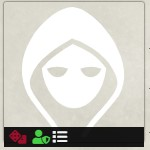
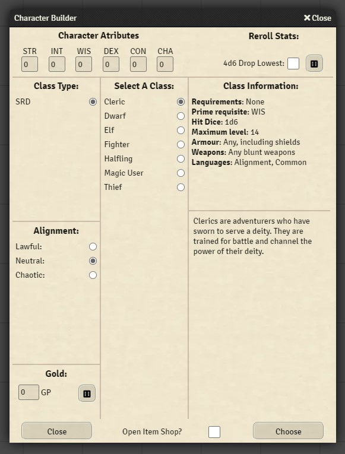

# OSR-Character-Builder

A module that adds a basic character builder to the Foundry Vtt implementation of the 'Old School Essentials' system.

### Important Notice

If updating from the previous version named "OSE-helper", any macros existing in your game worlds from the previous version will no longer function. Please replace them with the included updated versions. We apologize for any inconvenience this causes.

If you have created custom light items in your world you will need to run the provided conversion macro named "Convert Light Data" located in the included macro compendium "Utility Macros" folder. This wil convert your existing light configurations, existing lights  will not function without conversion. this only needs to be run once.

---
## Installation

In the setup screen, use the URL https://raw.githubusercontent.com/RabidOwlbear/osr-character-builder/main/module.json to install the module.

## How To Use

When a new character sheet is created the character creator can be accessed via the flashing green icon in the bar that appears when the mouse cursor hovers over the character portrait.

When clicked the Character Builder window will appear.

- Character Attributes: The ability scores as rolled will appear here.
- Reroll Stats: Clicking the dice icon will roll 3d6 for each of the ability scores.
- 4d6 drop lowest: Pretty straight forward, when the box is checked the ability rolls will use the 4d6 drop lowest formula.
- Class Type: selecting an option in this list will display available class choices in the panel to the right. The module includes the OSE SRD classes.
- Select A Class: selecting a class in this list will display the information about that class in the class information panel on the right.
- Alignment: select alignment here.
- Gold: enter a gold amount or randomly roll starting gold by clicking on the dice button.

When finished selecting options/rolling scores clicking the Choose button at the bottom of the form will add the selected class options, stats gold etc. to the character sheet.
The module will now create an item for all 'standard' currency types when creating a new character.
Clicking the close button will exit out of the form without adding anything to the sheet.

#### Stat Roll Chat Message Settings
- Send character builder stat rolls to chat: When checked a chat message will be created whenever a user rolls/rerolls stats in the character builder.
- Whisper character builder stat rolls to the GM: When checked stat roll messages will be whispered to the GM instead of being sent to chat.
